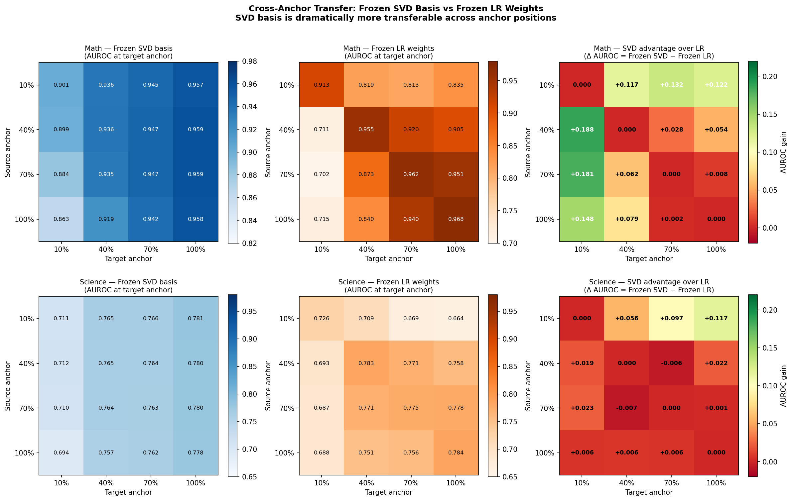
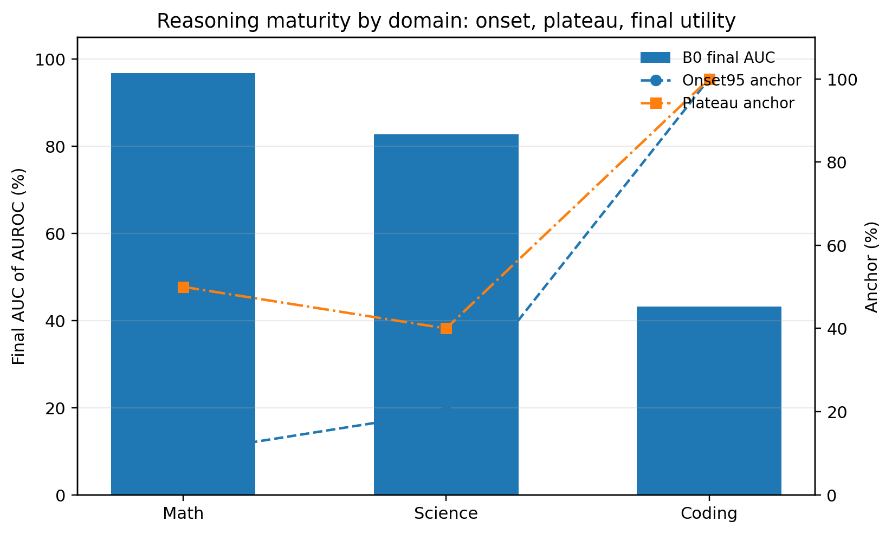

[English](README.md) | [中文](README.zh-CN.md)

# SVD_Domain

`SVD_Domain` 是从原始 `SVDomain` 中整理出来的一个英文主仓库，目标很简单：把真正有用的结论、表格、图和入口脚本留下来，把杂乱的草稿、缓存和提交文件拿掉。

## 这个仓库现在讲什么

当前版本主要围绕五条线索：

| 主题 | 当前结论 | 主要证据 |
| --- | --- | --- |
| Low-rank sufficiency | 中等 rank 已经足够，重点是紧凑性而不是“全面碾压” | `results/tables/lowrank_smallest_sufficient_rank.csv` |
| Frozen-basis transfer | 固定 basis 加一个新线性头，很多时候已经够用 | `results/tables/frozen_basis_transfer_deltas.csv` |
| Sparse cross-anchor transfer | `math` 跨 anchor 更稳，`science` 更依赖 basis 成熟度 | `results/tables/cross_anchor_transfer_summary.csv` |
| Dense-anchor timing | `math` 很早饱和，`science` 早期可用但后期仍会抬升 | `results/tables/dense_anchor_main_table.csv` |
| RL checkpoint ranking | 同一 latent object 对 checkpoint 顺序也有解释力 | `results/tables/checkpoint_correlation_summary.csv` |

## 快速结论

- `math`：best rank `24`，但 smallest sufficient rank 已经是 `16`
- `science` / `ms`：smallest sufficient rank 都是 `24`
- `earlystop / math`：frozen basis `0.9655`，task-specific `0.9658`
- `earlystop / science`：`0.7711` vs `0.7731`
- `math 10→100`：只差 `-0.19` pts
- `science 10→100`：会掉到 `-5.60` pts
- dense transfer 里最可迁移 source anchor：
  - `math` 是 `30%`
  - `science` 是 `50%`

一句话概括：

> 这个仓库最值得保留的发现，不是“一个 basis 解决一切”，而是“low-rank basis 的可复用性强烈依赖 domain 和 anchor maturity”。

## 图

<table>
  <tr>
    <td width="50%">
      
       
      Frozen-basis transfer
    </td>
    <td width="50%">
      
       
      Dense-anchor maturity
    </td>
  </tr>
</table>

## 使用方式

- 英文总览：`docs/00_EXECUTIVE_SUMMARY.md`
- 文档索引：`docs/README.md`
- 结果索引：`results/README.md`
- 总对比表：`results/comparison_tables.md`

## 复现边界

这个仓库不是完整训练环境。

- 根目录 `run_*.py` 更像公开入口包装器；
- 一部分实验仍依赖外部 `NAD_Next` 和本地 cache / model artifacts；
- 当前仓库的重点，是把“结论 + 证据 + 入口”整理成一个更干净的公开版本。
